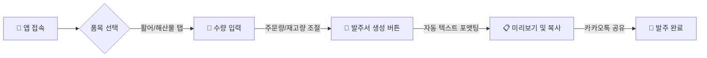

<div align="center">

# 🐟 어사출또 원터치 발주 (Osa Order)
### 매장 재고 관리 및 발주 자동화 웹 애플리케이션

> **"복잡한 수기 발주는 그만! 터치 몇 번으로 재고 파악부터 발주서 전송까지 30초 컷"**
> 


<br><br>


</div>

---

## 📖 프로젝트 개요 (Overview)
**어사출또 원터치 발주**는 매일 반복되는 횟집 식자재 주문 과정을 디지털화하여, **주문 실수(오타)를 방지**하고 **업무 시간을 단축**하기 위해 개발된 모바일 웹 서비스입니다.
활어, 해산물 등 카테고리별로 재고와 주문량을 입력하면, 거래처에 바로 보낼 수 있는 **텍스트 형식의 발주서를 자동으로 생성**해줍니다.

| 항목 | 내용 |
| :--- | :--- |
| **개발 기간** | 2024.10 ~ 2024.11 (약 1달) |
| **개발 인원** | **1인 개발 (Frontend Only)** |
| **주요 타겟** | 어사출또 매장 관리자 및 직원 |
| **배포 형태** | Static Web Page (Single HTML File) |

### 🛠️ 기획 배경
* **문제점:** 기존에는 재고를 파악한 뒤 카카오톡이나 문자로 품목명과 수량을 일일이 타이핑해서 보냈습니다. 이 과정에서 오타가 발생하거나 누락되는 경우가 잦았습니다.
* **해결책:** 터치 UI로 간편하게 수량을 조절하고, 버튼 하나로 정해진 양식의 텍스트를 생성하여 복사/공유할 수 있는 시스템을 구축했습니다.

---

## 📐 사용자 워크플로우 (User Flow)



---

## 🚀 주요 기능 (Key Features)

### 1. 📂 카테고리별 품목 관리
* **활어, 해산물, 패류, 기타** 등 4개의 탭으로 분류하여 원하는 품목을 빠르게 찾을 수 있습니다.
* `광어`, `우럭`, `낙지` 등 매장에서 실제로 취급하는 품목 리스트가 내장되어 있습니다.

### 2. 🔢 직관적인 수량 입력 (Touch UI)
* 모바일 환경에 최적화된 **[+] [-] 버튼** 인터페이스를 제공합니다.
* **'주문량(발주)'**과 **'현재 재고'**를 동시에 입력하여 매장 상황을 한눈에 파악할 수 있습니다.

### 3. 📝 발주서 텍스트 자동 생성
* 입력된 데이터를 바탕으로 **날짜, 카테고리, 품명, 주문/재고 수량**이 포함된 깔끔한 보고서 텍스트를 생성합니다.
* 입력되지 않은 품목은 자동으로 제외되어 내용이 간결합니다.

### 4. 📋 원터치 복사 및 공유
* **[텍스트 복사]** 버튼: 클립보드에 복사하여 어디든 붙여넣기 가능
* **[카톡 공유]** 버튼: 모바일 네이티브 공유 기능(Web Share API) 호출

---

## 💻 기술 스택 (Tech Stack)

* **Structure:** HTML5 (Semantic markup)
* **Styling:** **Tailwind CSS** (CDN 활용, 유틸리티 클래스 기반 반응형 디자인)
* **Logic:** **Vanilla JavaScript** (DOM 조작, 데이터 상태 관리, Web Share API 연동)
* **Icons:** SVG Icons (Phosphor/Heroicons 스타일 적용)

---

## ⚙️ 실행 화면 (Preview)

<div align="center">

| 1. 메인 및 입력 화면 | 2. 발주서 생성(모달) |
| :---: | :---: |
|  |  |
| **품목별 수량 터치 입력** | **자동 생성된 텍스트 확인** |

</div>

---

## 🔧 설치 및 실행 방법 (How to Run)

이 프로젝트는 별도의 빌드 과정이나 서버 설치가 필요 없는 **단일 HTML 파일**입니다.

1.  저장소를 클론(Clone)하거나 `index.html` 파일을 다운로드합니다.
    ```bash
    git clone [https://github.com/your-username/osa-order-system.git](https://github.com/your-username/osa-order-system.git)
    ```
2.  `index.html` 파일을 크롬, 사파리 등 **웹 브라우저에서 실행**하면 바로 사용할 수 있습니다.
3.  모바일 기기에서는 "홈 화면에 추가"를 통해 앱처럼 사용할 수 있습니다.

---

## 📞 Contact
* **Email:** minseok.c02@gmail.com
* **GitHub:** [https://github.com/asdzxc000115](https://github.com/asdzxc000115)
